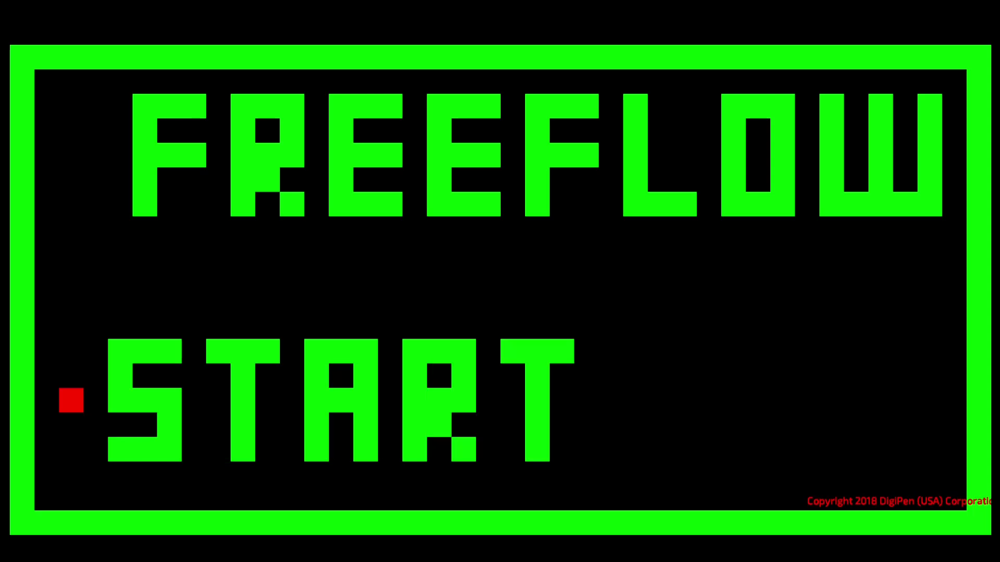
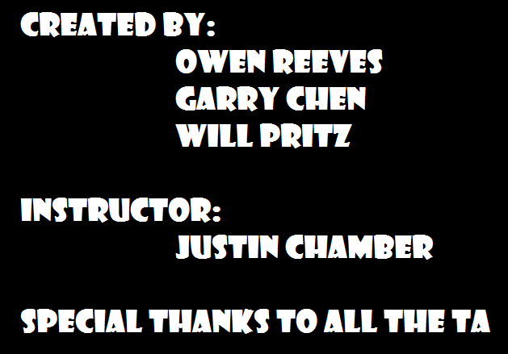

<!-- PROJECT LOGO -->
 

    
  </a>

  <h3 align="center">My Freshman year Team Game Project</h3>

  

    <a href="https://youtu.be/tOwg3v_gdlI">Demo video</a>
  

<!-- TABLE OF CONTENTS -->

  
Table of Contents

  <ol>
    <li>
      <a href="#about-the-project">About The Project</a>
      <ul>
        <li><a href="#built-with">Built With</a></li>
      </ul>
    </li>
    <li>
      <a href="#roadmap">Roadmap</a>
    </li>
    <li><a href="#copyright">Copyright</a></li>
    <li><a href="#contact">Contact</a></li>
  </ol>

<!-- ABOUT THE PROJECT -->
## About The Project

![Product Name Screen Shot][product-screenshot]

In this project I learned the teamwork, communication and self taught various systems as needed. 

The game is a speed runner game where player controls a wall bouncing cube to reach the goal as fast as possible.

### Built With

This project was build with libaries provided by course professor [Justin S Chamber](https://www.linkedin.com/in/justinschambers/).
* C_Processing.h
* Engine.h

<!-- ROADMAP -->
## Roadmap

List of features I implemented for this project.

* basic runner-game game loop 
* tile map making/loading
* tile type and functionality
* camera with detection box
* collision detection using ray-cast
* collision resolution

<!-- copyright -->
## Copyright

Copyright © 2018 DigiPen, All rights reserved.

<!-- CREDITS -->
## Credits

<!-- CONTACT -->
## Contact

Garry Chen

 

<!-- MARKDOWN LINKS & IMAGES -->
<!-- https://www.markdownguide.org/basic-syntax/#reference-style-links -->
[linkedin-url]: https://linkedin.com/in/othneildrew
[product-screenshot]: pic/vlcsnap-2021-05-28-16h41m59s845.png

